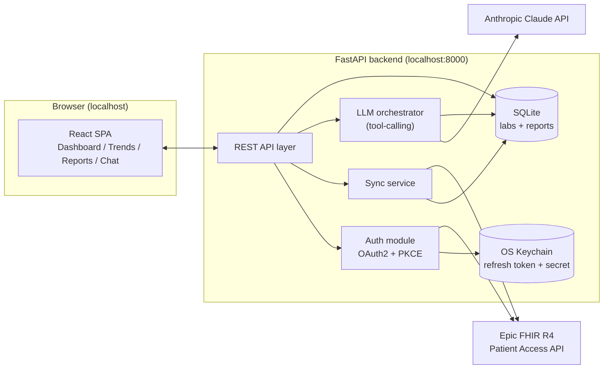
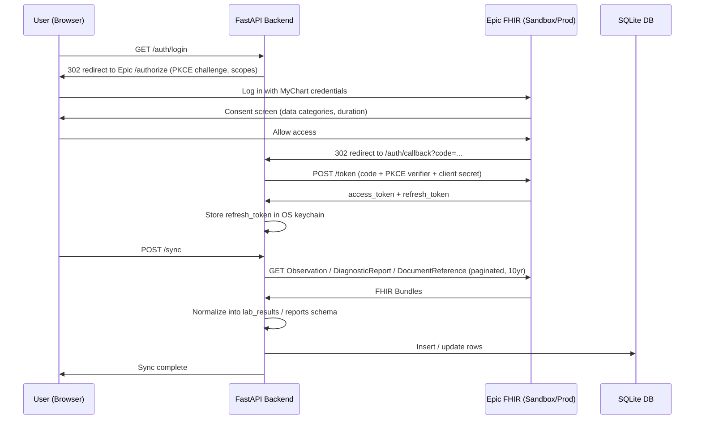
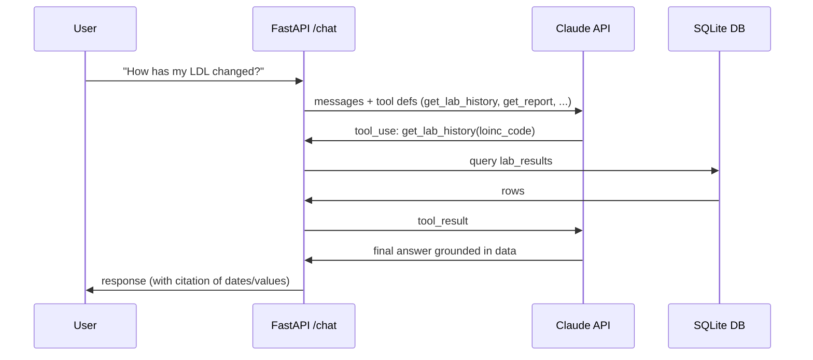

# Personal Health Assistant — Implementation Plan

Status: Draft v1
Date: 2026-09-20
Companion docs: `PRD_v2.md` (requirements), `TERMS.md` (Epic app terms)

## 1. Where we are

Already done, verified against Epic's public sandbox:

- [x] Epic on FHIR developer account + app registered (`Personal Lab Results AI Assistant`, individual developer, Patients audience, USCDI v3 automatic distribution)
- [x] Incoming APIs granted: `Patient.Read (Demographics)`, `Observation.Read (Labs)`, `DiagnosticReport.Read (Results)`, `DocumentReference.Read (Clinical Notes)` (all R4)
- [x] OAuth config: confidential client, SMART v2, rolling refresh tokens, persistent access, PKCE (S256) supported
- [x] Public Documentation URL + Terms and Conditions URL hosted on GitHub (`Sherif-Y/personal-health-assistant`)
- [x] Data Use Questionnaire answered
- [x] App marked "Test" (sandbox-ready); Non-Production Client ID obtained
- [x] End-to-end OAuth2 + PKCE authorization flow manually verified against Epic's sandbox: login (synthetic patient `fhircamila`), consent screen matching our granted scopes, redirect to `localhost:8000/auth/callback` with a valid `code` + matching `state`
- [x] UX mockup built covering all P0 screens (Lab Results, Trends, Reports, Chat)

Not yet started: any actual application code (backend or frontend).

## 2. Tech stack

| Layer | Choice | Why |
|---|---|---|
| Backend | Python 3.11+, FastAPI, Uvicorn | Strong FHIR/HTTP ecosystem, easy LLM tool-calling, async support for token refresh + sync |
| HTTP / FHIR client | `httpx` + hand-rolled Pydantic models for the ~4 resource types we use | A generic FHIR client library is overkill for 4 resource types with Epic-specific category scoping; direct calls are easier to debug against Epic's quirks |
| OAuth2 / PKCE | `authlib` (or a small hand-rolled PKCE helper if Authlib's Epic-specific behavior gets in the way) | Handles code_verifier/code_challenge generation and token exchange correctly |
| Database | SQLite via `SQLModel` (SQLAlchemy + Pydantic) | Single-user, zero-ops, matches "local app" scope |
| Secret storage | OS keychain via `keyring` for the Epic refresh token and client secret | Never written to disk in plaintext; relies on the OS login, not app-level crypto |
| At-rest hardening (stretch) | SQLCipher-encrypted SQLite | Optional upgrade beyond relying on FileVault/disk encryption; not MVP-blocking |
| LLM | Anthropic Claude API (`anthropic` Python SDK), tool-calling | Matches the system prompt already designed; grounds answers in DB queries instead of free recall |
| Frontend | React + Vite + TypeScript | Fast local dev loop; matches the UX mockup's component structure |
| Charts | Recharts | Straightforward React charting for the Trends view's line charts + reference bands |
| Styling | Hand-written CSS using the mockup's design tokens (teal/cream palette, Fraunces/Work Sans/IBM Plex Mono) | Keep the shipped app visually consistent with the approved mockup |
| Packaging for daily use | FastAPI serves the built React static assets under `/`, API under `/api/*` | One process, one `uvicorn` command to run the whole app locally — matches "local web-based app" simplicity |

## 3. System architecture

## 4. Key flows

### 4.1 Login + first sync

### 4.2 Chat / summary (tool-calling, grounded)

## 5. Implementation phases

### Phase 0 — Project scaffolding
- [ ] `git init`, `.gitignore` (excludes `.env`, `*.db`, `__pycache__`, `node_modules`, `dist`)
- [ ] `.env.example` (placeholders: `EPIC_CLIENT_ID`, `EPIC_CLIENT_SECRET`, `EPIC_FHIR_BASE_URL`, `EPIC_REDIRECT_URI`, `ANTHROPIC_API_KEY`)
- [ ] Backend skeleton: `backend/app/{main.py, auth/, sync/, api/, llm/, db/}`
- [ ] Frontend skeleton: `frontend/` via Vite React-TS template

### Phase 1 — Auth module
- [ ] PKCE code_verifier/code_challenge generation
- [ ] `GET /auth/login` → redirect to Epic authorize endpoint
- [ ] `GET /auth/callback` → exchange code for tokens at Epic token endpoint
- [ ] Store refresh token + client secret in OS keychain (`keyring`)
- [ ] Token refresh logic: persist the **new** refresh token on every rotation (rolling refresh tokens)
- [ ] Verify against sandbox end-to-end (real code, not just the manual browser test already done)

### Phase 2 — Sync service
- [x] FHIR client wrapper (`httpx`, bearer auth, pagination via `Bundle.link[rel=next]`)
- [x] SQLModel models for LabResult, Report, SyncMetadata
- [x] Normalization: numeric labs → `lab_results` table; narrative/document results → `reports` table
- [x] `POST /sync` endpoint — verified end-to-end against sandbox (1 lab result, 4 diagnostic reports, 1 clinical note)
- [ ] First sync: 10-year historical date-range pull (current version fetches all available, untested at that volume/pagination depth)
- [ ] Progress reporting for a large first sync (avoid appearing to hang)
- [ ] Binary attachment narrative extraction — **deferred/out of scope for now**: `Report.narrative_text` fetch degrades
      gracefully (stays empty) since the `Binary` resource requires its own separate API grant on Epic's app
      registration, which we haven't added. Report metadata (title, type, date) syncs fine without it.

**Findings from sandbox testing** (relevant again for the Phase 7 production cutover):
- Epic grants `Read` and `Search` as *separate* API permissions — a resource registered as "Read" only supports
  fetching by exact ID, not `?patient=X` queries. Had to add `.Search` variants for Observation, DiagnosticReport,
  and DocumentReference after hitting `insufficient_scope` errors.
- Report/document narrative text is not inline on `DiagnosticReport.conclusion` in this sandbox account — it's a
  separate `Binary/{id}` reference (`presentedForm`/`content[].attachment`) requiring its own `Binary` API grant.
- Search result bundles can include a non-matching `OperationOutcome` disclaimer entry alongside real results —
  filter bundle entries by `resourceType`, don't assume every entry matches the requested resource type.
- Changes to the app's registered Incoming APIs are not applied instantly — expect a propagation delay (observed:
  tens of minutes) before a newly added API grant actually works, even though it appears saved immediately.

### Phase 3 — API layer
- [x] `GET /labs` (tabulated, grouped by category, filterable by `category`/`search`)
- [x] `GET /trends/metrics` (distinct trackable metrics) + `GET /trends` (time series per LOINC code)
- [x] `GET /reports`, `GET /reports/{id}`
- [ ] `GET /summary` (cached, regenerated on new sync)
- [ ] `POST /chat`

### Phase 4 — LLM integration
- [x] Implement tools: `get_lab_history`, `get_latest_panel`, `get_reference_range`, `list_reports`, `get_report`
- [x] Wire the system prompt already designed in `PRD_v2.md`
- [x] `GET /summary` — verified: correctly grounds in real data, explicitly declines to guess at report
      findings since narrative text isn't populated yet (Binary access deferred), rather than fabricating
- [x] `POST /chat` with tool-calling loop — verified against a specific question, correctly filtered by report type
- [ ] Cache invalidation: `/summary` currently caches in-memory until `refresh=true`; wire it to auto-invalidate
      when `/sync` completes

### Phase 5 — Frontend
- [ ] Build the 4 screens from the approved UX mockup (Lab Results, Trends, Reports, Chat) as React components
- [ ] Wire to backend API
- [ ] Recharts implementation of the Trends view (reference-range band, multi-metric comparison)
- [ ] Match mockup's design tokens (colors, fonts) in a shared stylesheet/theme

### Phase 6 — Sandbox end-to-end validation
- [ ] Full flow: login → sync → view labs/trends/reports → ask chat questions, all against Epic's sandbox synthetic patient
- [ ] Confirm out-of-range flagging, trend direction, and report summaries are accurate against known sandbox data

### Phase 7 — Production cutover

**Security hygiene (do before touching real PHI):**
- [ ] Rotate the Anthropic API key (the sandbox Epic secret is lower-stakes and left as-is per decision on
      2026-09-21 — it only grants access to synthetic sandbox data)

**Local HTTPS (required for production redirect URI):**
- [x] Self-signed cert generated (`backend/certs/`, gitignored) via `openssl`, since Homebrew/`mkcert` aren't
      available on this machine. Browsers will show an untrusted-cert warning on first use — acceptable for a
      personal local app; add to macOS Keychain trust if that's annoying.
- [ ] Run uvicorn with `--ssl-keyfile certs/localhost-key.pem --ssl-certfile certs/localhost-cert.pem` and confirm
      `https://localhost:8000/auth/callback` actually works before adding it to Epic's registration.

**Epic app registration (must finalize before clicking "Ready for Production" — it locks after that):**
- [ ] Identify the exact health system / Epic organization (in progress — check the MyChart login page for the
      organization name)
- [ ] Look up that organization's production FHIR base URL + OAuth endpoints (different from the generic sandbox
      ones at `fhir.epic.com/interconnect-fhir-oauth/...`)
- [ ] Add the `https://localhost:8000/auth/callback` redirect URI alongside the existing http one
- [ ] Decide whether to add `Binary` API access now (needed for real report narrative text) while the
      registration is still editable — currently deferred/degrades gracefully without it
- [ ] Click "Save & Ready for Production" — check whether USCDI v3 automatic distribution grants access
      immediately for this org, or whether it needs manual review

**Cutover:**
- [ ] Update `backend/.env` with production `EPIC_CLIENT_ID`, `EPIC_CLIENT_SECRET`, `EPIC_FHIR_BASE_URL`,
      `EPIC_AUTHORIZE_URL`, `EPIC_TOKEN_URL`, `EPIC_REDIRECT_URI` (production values, not sandbox)
- [ ] Log in with real MyChart credentials, run first sync, verify pagination/volume handling at real scale
      (sandbox only ever had 1 lab result + 5 reports — untested at realistic volume)
- [ ] Spot-check the AI summary and lab values against what MyChart's own UI shows, before trusting it day-to-day

**Not yet started:**
- [ ] `git init` was done but nothing has been committed yet — worth an initial commit once secrets are confirmed
      out of the working tree
- [ ] Onboarding flow (Welcome/Connecting/First Sync screens from the UX mockup) isn't built in the real frontend
      yet — currently just a bare "Connect MyChart" gate

### Phase 8 — Deferred (Phase 2/3 per PRD)
- WhatsApp integration
- Excel/image upload ingestion
- Packaged distributable app

## 6. Open items carried over from PRD_v2.md

- Exact health system FHIR endpoint (needed before Phase 7)
- Whether reports arrive as structured text (`conclusion`) or PDF attachments (`presentedForm`) — determines if a PDF-text-extraction step is needed in Phase 2
- Report categories actually present in this account (affects Reports view grouping)
- Chat conversation persistence model (single thread vs. per-session)
